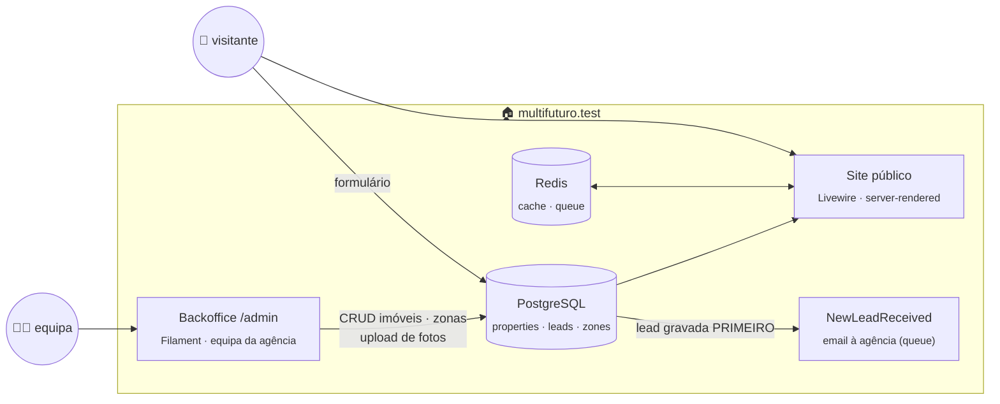

<div align="center">

# Multifuturo<span>.</span>

**Website da Multifuturo Imóveis Lda** — mediação imobiliária

*Backoffice próprio + site público sobre a mesma base de dados — sem CRM externo.*

[](https://github.com/Davide5fonseca/Multifuturo/actions/workflows/tests.yml)


<br><sub>a paleta: bege pastel como base, verde azeitona como acento · Fraunces + Inter, servidas localmente</sub>

<br>

[**📋 O que falta para ir online**](docs/CHECKLIST.md) · [**📜 Changelog por commit**](CHANGELOG.md) · [🐛 Issues](https://github.com/Davide5fonseca/Multifuturo/issues)

</div>

---

## 🧭 Arquitetura

> **Não há CRM externo:** a equipa gere a carteira no **backoffice próprio
> (`/admin`, Filament)**, que escreve na mesma base de dados que o site lê.



| Decisão | Porquê |
|---|---|
| Backoffice e site sobre a mesma BD | zero sincronização; o que se grava aparece no site (cache invalidada na hora) |
| Lead gravada localmente antes do email | email falha ⇒ contacto não se perde; fica na caixa de entrada do /admin |
| Server-rendered, sem SPA | SEO — cada listagem, ficha e zona é indexável |
| Cache Redis com tag | limpa automaticamente ao gravar no backoffice |

## 🌍 Produção

O deploy está preparado e testado: Docker em produção com Apache (mod_php; o HTTPS termina no Apache do anfitrião),
fila, agendador, PostgreSQL e Redis — `compose.production.yaml`,
`docker/production/`, `deploy/deploy.sh` e `deploy/restore.sh`. O guia completo, do
servidor vazio ao site no ar e às atualizações, está em **[DEPLOY.md](DEPLOY.md)**.

## 🚀 Começar

> [!IMPORTANT]
> **Máquina nova:** copie o `.env.example` para `.env` **antes** do `composer install`.
> O `package:discover` arranca a aplicação e, sem `APP_ENV`, ela assume produção e
> **recusa arrancar sem `AGENCY_AMI`** — é intencional (Lei n.º 15/2013).

Pré-requisito: Docker Desktop a correr. O `./vendor/bin/sail` só corre em
macOS/Linux/WSL2 — **no Windows** usa o wrapper `sail.ps1`:

```powershell
.\sail.ps1 up -d              # arranca app + nginx + fila + agendador + PostgreSQL + Redis + Mailpit
.\sail.ps1 artisan migrate    # cria as tabelas
npm install; npm run build    # assets (ver nota abaixo)
```

### Onde corre, e em que endereços

Tudo corre em **Docker, na sua máquina** — não há nada online.

| | Endereço |
|---|---|
| **Site** | **http://localhost/multifuturo** |
| **Backoffice** | **http://localhost/multifuturo/admin** |
| Emails de teste (Mailpit) | http://localhost:8025 |
| PostgreSQL | `localhost:54320` |
| Redis | `localhost:63790` |

`http://localhost/` reencaminha para `/multifuturo/`.

<details>
<summary><b>Como funciona a subpasta /multifuturo</b></summary>

<br>

O Sail serve a aplicação com `php artisan serve`, que só sabe responder na raiz. Por isso
há um **nginx à frente** (serviço `proxy` no `compose.yaml`), que fica com a porta 80 do
host e retira o prefixo antes de entregar o pedido à aplicação:

```
browser → localhost/multifuturo/comprar → nginx → app: /comprar
```

Do lado do Laravel são precisas duas coisas, ambas já feitas:

| Onde | O quê |
|---|---|
| `APP_URL=http://localhost/multifuturo` | [`AppUrl`](app/Support/AppUrl.php) força a raiz dos URLs, para os links e assets saírem com o prefixo |
| `X-Forwarded-Prefix` em [`bootstrap/app.php`](bootstrap/app.php) | faz `$request->url()` incluir o prefixo — sem isto os **URLs assinados** (upload de ficheiros do Livewire) falhavam a validação |

O Livewire pede alguns endereços a partir da raiz (`/livewire/update`), porque os constrói
como caminhos relativos; o nginx encaminha-os tal e qual.

**Para mudar de subpasta** — três sítios: `APP_URL` no `.env`, e o prefixo em
[`docker/nginx/default.conf`](docker/nginx/default.conf) e
[`docker/nginx/proxy-headers.inc`](docker/nginx/proxy-headers.inc).
Os **testes correm sempre na raiz** (`APP_URL` fixo no `phpunit.xml`).

</details>

<details>
<summary><b>Portas, domínio local e atalhos do wrapper</b></summary>

<br>

| Serviço | Porta no host |
|---|---|
| nginx (serve o site) | `80` |
| Aplicação | interna, sem porta no host |
| Fila (`queue:work`) | interna, sem porta |
| Agendador (`schedule:work`) | interna, sem porta |
| Vite (HMR) | `5173` |
| PostgreSQL | `54320` † |
| Redis | `63790` † |
| Mailpit (email de teste) | `8025` (UI) |

† 5432/6379 estavam ocupadas por outros serviços nesta máquina.


> **Desempenho em Windows:** o Sail serve o site com `php artisan serve`, ou seja pelo
> SAPI de linha de comandos — onde o **OPcache vem desligado**. Com o projeto no disco do
> Windows e montado no container, cada pedido recompilava centenas de ficheiros PHP
> através dessa ponte (**2 a 3 segundos por página**). O `docker/php-dev.ini`, montado
> pelo `compose.yaml`, liga o OPcache e aumenta a cache de caminhos — as páginas passam a
> ~**0,15 s**. As alterações ao código aplicam-se dentro de 10 segundos
> (`opcache.revalidate_freq`); para as ver de imediato, `.\sail.ps1 restart`.

> **Assets:** o tema do Filament instalou dependências dentro do container, por isso
> compile lá — `.\sail.ps1 npm run build`. Correr `npm install` no Windows volta a
> partir os binários nativos do container (e vice-versa).

**Atalhos do `sail.ps1`:** `artisan` · `composer` · `npm` · `pest` · `pint` · `tinker` ·
`shell` (bash no container) · `psql` · `redis` · `logs` · `ps`

</details>

## ⚙️ Configuração

Copiar `.env.example` → `.env` e preencher por grupo:

| Grupo | Variáveis | Config |
|---|---|---|
| 🏢 Agência | `AGENCY_NAME` · **`AGENCY_AMI`** · `AGENCY_PHONE/EMAIL/ADDRESS` · redes sociais · `AGENCY_COMPLAINTS_BOOK_URL` · `AGENCY_PRIVACY_POLICY_VERSION` · `AGENCY_HERO_IMAGE` | `config/agency.php` |
| 🍪 Cookies | `CONSENT_COOKIE` · `CONSENT_DAYS` · `CONSENT_VERSION` | `config/consent.php` |

> [!WARNING]
> Três regras que não são óbvias:
> - **`AGENCY_AMI`** é obrigatório por lei na comunicação comercial de mediação — em produção a app não arranca sem ele.
> - O domínio **nunca** é hardcoded: canonical, sitemap, OG e emails derivam de `APP_URL`.
> - Ao alterar o texto da política de privacidade, atualizar `AGENCY_PRIVACY_POLICY_VERSION` — cada lead guarda a versão que lhe foi apresentada.

## 🚪 Portal da equipa (/entrar → /portal)

A equipa entra uma vez (`/entrar`: email, palavra-passe e, com `PORTAL_MFA=true`, um
código de seis algarismos enviado por email) e aterra em `/portal`, uma página de
cartões com os **módulos** a que tem acesso. O backoffice de imóveis (`/admin`) é o
primeiro módulo e já não tem login próprio. Mesma estrutura do Nexus Portal, dentro
desta aplicação.

- Módulos: `config/modules.php` (chave, nome, ícone, rota, painel do Filament). Um módulo
  novo = uma área nova (painel ou aplicação) + uma entrada aqui + acessos às pessoas.
- Acessos: `module_access` (pessoa × módulo); administradores veem tudo. Geridos no
  portal, em Gestão → Equipa e acessos (só administradores). Contas desativadas (`is_active`) são postas fora no pedido seguinte.
- Códigos MFA: `mfa_codes` (só o hash; 10 min; 5 tentativas; reenvio ao fim de 60 s).

## 🗂️ Backoffice (/admin)

O painel de gestão da agência — substitui o CRM. Filament 4, cor da marca, pt-PT.

| Módulo | O que faz |
|---|---|
| **Imóveis** | criar/editar com formulário por secções (identificação, conteúdo, preço/áreas, localização, edifício, publicação); **upload de fotografias** com reordenação (a 1.ª é a capa, guardadas em `storage/app/public/imoveis`); características com sugestões; interruptores rápidos publicado/destaque na listagem; filtros por finalidade/estado/concelho |
| **Pedidos do site** | caixa de entrada das leads (só leitura — não se criam à mão), badge com a contagem dos últimos 7 dias, detalhe com consentimentos RGPD |
| **Clientes** | compradores, proprietários ou ambos; agrega leads e eventos de cada pessoa |
| **Equipa** | contas de quem entra no backoffice — só visível a administradores |
| **Agenda** | telefonemas, visitas, reuniões, tarefas e lembretes |
| **Calendário** | vista mensal/semanal/diária dos eventos, com filtros por utilizador e tipo |

A **dashboard** repete os quadros do antigo CRM: leads de angariação e de compradores
(com pipeline e prioridade), actualizações (histórico automático dos imóveis), agenda e
gráfico de visualizações dos últimos 30 dias.

Automatismos: `internal_id` (`BO-…`), `slug` (estável — nunca recalculado ao editar) e
`payload_hash` são gerados na criação; a **cache do site é invalidada** em cada gravação.
**Criar um utilizador** (não há registo público):

```powershell
.\sail.ps1 artisan tinker --execute="App\Models\User::create(['name'=>'Nome','email'=>'pessoa@multifuturo.pt','password'=>bcrypt('palavra-passe')]);"
```

Cada lead nova dispara um **email à equipa** (`NewLeadReceived` → cada administrador do backoffice e `AGENCY_EMAIL`, via
queue) e fica na caixa de entrada. Requer `php artisan storage:link` (fotos) e
`queue:work` (emails).

## ✉️ Leads

**Fluxo:** formulário → `StoreLeadRequest` valida → **grava local primeiro** → email à agência (queue) → caixa de entrada no `/admin`.

- 🕵️ **Anti-spam sem CAPTCHA:** honeypot (aceite em silêncio, sem gravar) · timestamp
  assinado com a `APP_KEY` (rejeita < 3 s ou forjado) · rate limiting por IP (5/min, 20/h, chave = hash do IP).
- 🇪🇺 **RGPD:** dois consentimentos separados (`IncludeOptIn`/`IncludeMailing`), desmarcados,
  nunca forçados; `policy_version` e `ip_hash` (HMAC — nunca o IP) gravados em cada lead.
- 🧵 Requer worker: `php artisan queue:work` (em produção, como serviço).

## 🖼️ Frontend

```powershell
npm run dev      # Vite com HMR
npm run build    # produção → public/build (não versionado)
```

Tipografia **Fraunces + Inter** servida de `public/fonts/` (zero pedidos a CDNs).
Tokens de cor em `resources/css/app.css` (`@theme`) — **nunca** hex soltos nos componentes.
Direção: fotografia grande, muito espaço branco, tipografia sóbria; o azeitona é acento
(botões, estados ativos), nunca fundo de áreas grandes.

| Rota | Conteúdo |
|---|---|
| `/` | hero · pesquisa · destaques · sobre · porquê · zonas · banda de contacto |
| `/comprar` · `/arrendar` | listagem Livewire, filtros na query string, 12/página, URLs partilháveis |
| `/imoveis/{slug}` | galeria + lightbox · JSON-LD `RealEstateListing` · mapa só com `gmap_visible` e a pedido · semelhantes · formulário pré-preenchido · inativo ⇒ **410** |
| `/zonas/…` | páginas por concelho/freguesia derivadas da carteira; editorial opcional (tabela `zones`) |
| `/favoritos` | localStorage, sem registo |
| `/quanto-vale-a-minha-casa` | lead magnet de avaliação |
| `/sitemap.xml` · `/robots.txt` | dinâmicos; sitemap só com ativos; robots bloqueia fora de produção |

Cache de leituras: `App\Support\PropertyCache` (tag `properties`, TTL 1 h), limpa pelo evento `PropertiesSynced`.

## 🛡️ Privacidade, RGPD e conformidade

| Garantia | Como |
|---|---|
| Dados do proprietário **nunca** persistidos | nó `Owner` removido do DOM antes do mapeamento; sem coluna; testes procuram fugas em todas as colunas |
| Coordenadas protegidas | `gmap_visible=false` ⇒ nem HTML nem JSON-LD as contêm (acessor devolve `null`) |
| Zero pedidos externos sem consentimento | fontes locais; mapa OSM só ao clicar; scripts de terceiros via `<x-consent-script>` (`type="text/plain"` até opt-in); teste garante que nenhuma página chama fora |
| Banner de cookies granular | necessários / análise / marketing; recusa com o mesmo peso visual; cookie first-party 180 dias; "Gerir cookies" no rodapé |
| Rodapé legal | AMI · Livro de Reclamações eletrónico · políticas |

Textos legais em `lang/pt/legal.php` — **minutas**, carecem de revisão jurídica.

## 🔄 Filas e contas

> [!IMPORTANT]
> **O aviso por email de cada pedido do site é enviado em fila.** Sem um processo a
> tratar da fila, os pedidos ficam guardados e aparecem no backoffice, mas **o email
> nunca sai**. Localmente é o serviço `queue` do `compose.yaml`; **em produção tem de
> haver um processo equivalente sempre a correr** (`php artisan queue:work`), reiniciado
> automaticamente se cair.

O sino do backoffice não depende da fila — é escrito no próprio pedido. Ou seja: mesmo
com a fila parada, a equipa vê o pedido ao entrar no painel; o que se perde é o email.

**Contas da equipa** vivem em **Equipa** (`/admin/users`), visível só a administradores:

| | |
|---|---|
| Criar conta | nome, email e palavra-passe (mínimo 8 caracteres) |
| Administrador | gere as contas da equipa; os restantes usam o backoffice normalmente |
| Palavra-passe | ao editar, em branco mantém a atual |
| Proteções | ninguém se apaga nem se despromove a si próprio |

Cada pessoa muda o seu nome e a sua palavra-passe no **perfil** (canto superior direito),
e quem se esquecer dela recupera-a por email — o que exige o `MAIL_*` configurado.

## 💾 Cópias de segurança

Uma cópia por dia, **sempre à mesma hora** (`BACKUP_AT`, por omissão `03:30`), com a
**base de dados** e os **ficheiros carregados** — fotografias e documentos, que só
existem em disco. Guardadas em `storage/backups/`, fora de `public/`.

| | |
|---|---|
| `BACKUP_AT` | hora da cópia diária (24h) |
| `BACKUP_KEEP_DAYS` | quantos dias guardar (por omissão 14; as mais antigas são apagadas) |
| À mão | `.\sail.ps1 artisan backup:run` |

> [!IMPORTANT]
> A cópia só acontece se houver um **agendador** a correr. Localmente é o serviço
> `scheduler` do `compose.yaml`; **em produção tem de haver um cron ou processo
> equivalente** (`php artisan schedule:run` a cada minuto, ou `schedule:work`).

**Restaurar** — descomprimir e passar ao `psql`. O `ON_ERROR_STOP` faz o restauro abortar
ao primeiro problema, em vez de deixar a base de dados a meio:

```bash
gunzip -c storage/backups/2026-08-25_033000/base-de-dados.sql.gz   | psql --host=$DB_HOST --username=$DB_USERNAME --dbname=$DB_DATABASE --set ON_ERROR_STOP=1
```

Os ficheiros restauram-se com `tar -xzf ficheiros.tar.gz -C storage/app/`.

> As cópias ficam **no mesmo servidor** que a aplicação. Isso chega para um clique errado
> ou uma migração falhada — **não chega para um disco avariado**. Assim que o alojamento
> estiver escolhido, convém copiá-las também para fora (outro fornecedor, ou o
> armazenamento de objetos do próprio).

## ✅ Testes e CI

```powershell
.\sail.ps1 pest    # 104 testes · Pest 3 · PostgreSQL "testing"
.\sail.ps1 pint    # estilo (--test para só verificar)
```

- PostgreSQL obrigatório nos testes (o schema usa `jsonb` + GIN; SQLite não serve).
- CI: [`.github/workflows/tests.yml`](.github/workflows/tests.yml) — Pint + Pest com
  PostgreSQL 16 e Redis em cada push/PR; em falha, as linhas do log saem como annotations.
- Regras críticas cobertas: slugs estáveis · `gmap_visible` · lead gravada antes do email ·
  AMI em produção · XSS · rate limiting · reciclagem e 410 · cópias de segurança.

<details>
<summary><h2>🗺️ Mapa do código</h2></summary>

```
app/
├── Console/Commands/     BackupRun (cópia diária) · ZonesImport
├── Enums/                BusinessType · LeadSource · LeadKind · LeadStage · EventType · …
├── Http/
│   ├── Controllers/      Page · Property (ficha, JSON-LD, 410) · Zone · Favorites · Lead · Sitemap · Robots
│   └── Requests/         StoreLeadRequest (validação + anti-spam)
├── Livewire/             PropertyListing (filtros na query string, paginação, cache)
├── Models/               Property (scopes, coordinates, generateSlug) · Lead · Zone
├── Notifications/        NewLeadReceived · LeadReply · ConfirmPropertyAlert · PropertyAlertDigest
├── Observers/            PropertyObserver (histórico das fichas)
└── Support/              AppUrl · AgencyCompliance (AMI) · Format · Geocoder · Locales · PropertyCache · Zones

config/    agency.php · consent.php · locales.php · backup.php
lang/pt/   ui.php (toda a UI) · legal.php (políticas) · validation/pagination/auth/passwords
resources/
├── css/app.css           tokens da marca (@theme) · fontes locais
├── js/                   app.js (favoritos, fallback de imagens) · consent.js (cookies)
└── views/
    ├── components/       layouts/app · site/{header,footer,search-form,consent-banner}
    │                     property/{card,image,gallery} · lead-form · consent-script
    ├── livewire/         property-listing
    ├── pages/            home · listing · property · property-gone · zones · zone ·
    │                     favorites · contact · valuation · legal
    └── errors/           404 (com pesquisa) · 500 · 503
tests/
└── Feature/              AgencyConfig · PublicPages · SeoFiles · PropertySchema · Leads ·
                          Frontend · Legal · EdgeCases · Backoffice* · Localization · …
```

</details>

---

<div align="center">
<sub>🏠 Multifuturo Imóveis Lda · pt-PT · Europe/Lisbon</sub>
</div>
